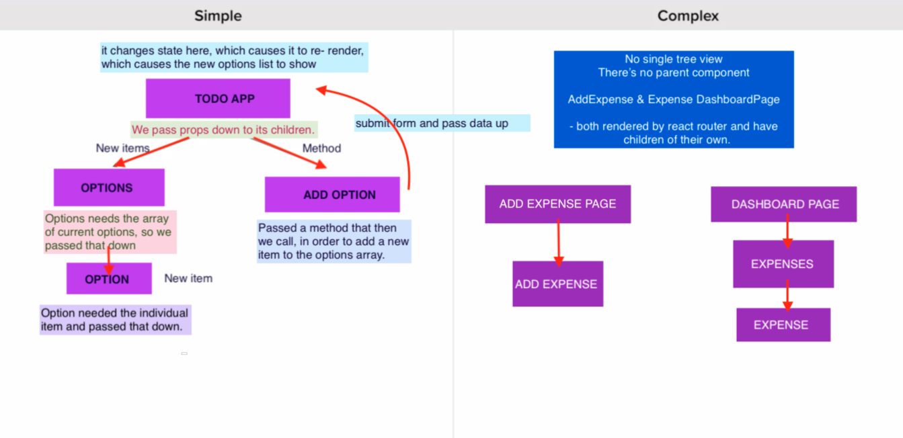
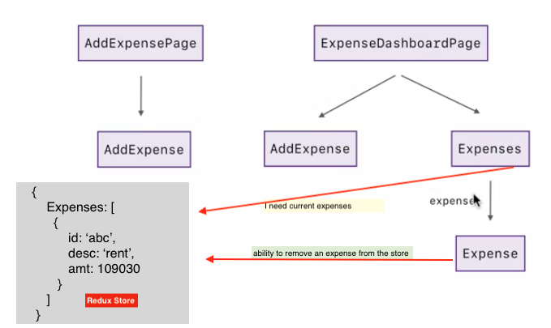

# boilerplateTpt

react


## Redux library 101

- ***state management*** library (or state container) that integrates with react and allows
  us track ***changing data***
- similar to ***component-based*** state where `this.state` that changes and we do something when
  it changes.
- they ***both manage state*** (component-based state and redux)



#### where to store state in a complex react app or create re-usable components
- by using redux, i hear
- props only pass from `Expenses` to `Expense`
- props are still a perfectly valid way of passing data between parent and child
- only time to avoid props is when passing data through a long chain of components just
  to get it to the last one in the chain.
- if you have components along a long chain just passing the data down, then redux would
  make more sense to use.


<br />




#### redux store

- an object

```
      ex: expenses array, each obj is a new expense
            {
               expenses: [
                  {
                     id: 'abc',
                     desc: 'rent',
                     amt: 109990
                  }
               ]
            }

```

#### to use react

- install redux
- import { createStore }
- we use createStore to create a store
- store tracks the changing data overtime.
- we pass a function in to create store, and this function gets call once right away
- there is no state the first time redux calls this function, so the default state
  value is used
- when we return that, it becomes the new state
- here below, count zero is the new state
- to fetch the current state, `getStore` method on store; which returns the actual
  object.


```
   const store = createStore((state={count:0}) => {
         return state;
   })

   store.getStore();

```

#### actions

- lets u change the redux store
- an object with type of action to send to store
- //walk, stop-walking, work, stop-working

- ex

```
      increment count, decrement count,reset count

         //actions
         store.dispatch({
            type: 'INCREMENT'   //type is default built-in  (action.type)
         });                    //can create others like incrementBy

         store.dispatch({
            type: 'DECREMENT',
         });

         store.dispatch({
            type: 'RESET',
         });

```

#### action generators

- it takes care of generating multiple action objects, through a function
  that returns a new action object


#### subscribing

- here refers to watching changes to store
- without `subscribe` any getStore call runs only when is called but what we
  need is to have it run only when the store state changes.
- by subscribing you can also dispatch an action pass along some data and not
  just action type


```
      ex: log store state changes anytime an action executed

      const unsubscribe = store.subscribe(() => {
         console.log(store.getState());
      });


      //actions
      store.dispatch({
         type: 'INCREMENT'
      });

      //call it here or anywhere u want
      unsubscribe();

      store.dispatch({
         type: 'INCREMENT'
      });

```

#### unsubscribe

- the return value from subscriber is a function that we can use to unsubscribe
- it doesn't take any arguments, just need to call it. (like clearInterval())


#### creating dynamic actions

- to pass dynamic information inside store objects and manipulate/change state

```
   ex:
      //actions
      store.dispatch({
         type: 'INCREMENT',
         incrementBy: 5
      });


      const store = createStore((state={count:0}, action) => {
         switch (action.type) {
            case 'INCREMENT':
            const incrementBy = typeof action.incrementBy === 'number' ? action.incrementBy : 1;
            return {
               count: state.count + incrementBy
            }
            ...
               ...


```

#### ES6 Object/Array Destructuring

##### Object Destructuring

```
   ex:
      allows us to take an object like person below and rip it apart, and pull
      off properties into their own variables.
      And instead of person.name, we can just create a name variable

      const person = {
         name: 'joe',
         age: 24,
         location: {
            city: 'Bristol',
            temp: 77
         }
      };

      // instead of:
      const name = person.name;
      const age = person.age;

      //like this:
      const { name, age  } = person;
      //call:
      console.log(`${name} is ${age}`);

      //rename
      const { name:isName, age} = person;

      //default value
      const { name= 'joe' } = person;

```

##### Array Destructuring

```
   ex:

      const address = ['1222 Paul House', 'Cardigan road', 'London', 'NW1234', 'UK'];

      const  [num, street, cty, post, country ] = address;

      //skip first item:
      //const [,strt,ct,pst,ctry] = address;

      //just destructure cty
      //const [,,cto,,] = address;

      console.log(`you are in ${street}, city of ${cty}, post is: ${post}`);


```


#### destructuring a function argument

```
const add = ({a,b,c},x) => { //x is a separate arg altogheter
   return a + b + c;
};

// you expect this to return:
console.log(add({a:1,b:2,c:3}));
```


### Reducers

- how the application state changes in response to an action.
- reducers are pure functions - output only determined by the arg are pass in.
- compute new state based on old state and action
- never directly change/re-assigned state/action values - mutate


```
      ex: reducer

      (state = { count: 0 }, action) => {
         switch (action.type) {          <---------- action


      •---------- reducer below ------------------•

       const countReducer = (state = { count: 0 }, action) => {
                  switch (action.type) {

                     case 'INCREMENT':
                        return {
                           count: state.count + action.incrementBy,
                        };
                     case 'DECREASE':
                        return {
                           count: state.count + action.decreaseBy,
                        };
                     case 'SET':
                        return {
                           count: action.count
                        }
                     case 'RESET':
                        return {
                           count: action.reset,
                        };
                     default:
                        return state;
                  } // switch
               }); // store


```

#### combining multiple reducers instead of having one single big reducer

- if the state gets a little more complex, then managing the state with
  several reducers is recommended

for example: just for the expense array not counting filter actions


```
// ADD_EXPENSE   add expense action
// REMOVE_EXPENSE  remove action
// EDIT_EXPENSE    edit action

// SET_TEXT_FILTER
// SORT_BY_DATE
// SORT_BY_AMOUNT
// SET_START_DATE
// SET_END_DATE

      const demoState = {
         expenses: [     <------array of objects reducer
            {
               id: 's1002bz',  //7-length
               description: 'June rent',
               note: 'final payment before moving out',
               amount: 150000,  //no decimal rent in pence - added twozeros
               createdAt: 0  //as timestamp
            }
         ],
         filters: {       <-------- an object reducer
            text: 'rent',
            sortBy: 'amount', //date or amount
            startDate: undefined //date range
         }

      };

      // then combine them together to create the store


```


#### covered here:

- component-based & redux store state management differences,
- store/state actions, & action generators,
- dynamic type actions,
- state watch subscribers,
- object/array destructuring
- reducers
